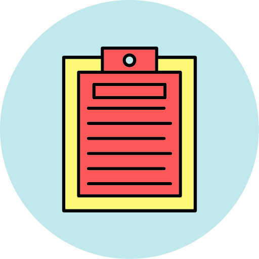

<div align="center">
    <a href="https://github.com/thiiagoms/vue-todo">
        
    </a>
    <h3 align="center">TODO List:memo:</h3>
    <p float="left">
        
         
        
    </p>
</div>

### Dependencies :memo:
- Docker :whale:

### Run :package:

01 -) Clone:
```bash
$ git clone https://github.com/thiiagoms/todo-vue
```

02 -) Got to `todo-vue` directory:
```bash
cd todo-vue
$ todo-vue
```

03 -) Run `docker-compose` to up/down containers
```bash
todo-vue $ docker-compose up -d
```

04 -) Go to `http://localhost:8080` on your computer :computer:

05 -) Turn off application:
```bash
todo-vue $ docker-compose down
```